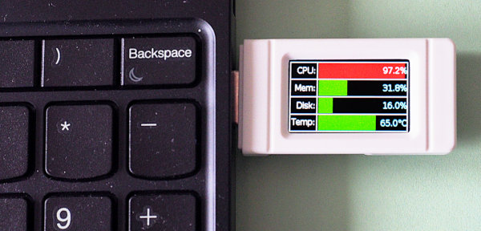
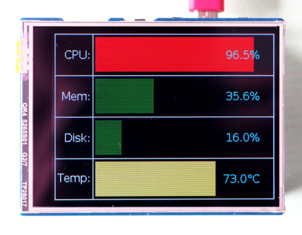

Small System Performance-Monitor
================================

This project implements a plugable performance monitor for PCs.
The datacollector is a small Python script running on the PC collecting
data and sending them using UART over USB. The monitor itself is a
microcontroller (e.g. Raspberry Pi Pico) with a attached display. The
MCU reads the data from the serial connection and does all the
presentation work.

PC-Installation
---------------

The PC-script needs the Python package `psutil` to collect performance
data like free memory, disk space or CPU-temperature. Install this
package either using your package-manager or with pip.

If you are running Linux, use:

    git clone https://github.com/bablokb/cp-sysmon
    cd cp-sysmon
    sudo pc/tools/install

to install the script, an udev-rule and a systemd-service. The latter
two are not strictly necessary, but they automatically start the
PC-script whenever a suitable MCU is plugged in. The script is copied
to `/usr/local/bin/cp_sysmon.py`, the udev-rule to
`/etc/udev/rules.d/99-cp_sysmon.rules` and the systemd-service to
`/etc/systemd/system/cp_sysmon@.service`.

PC-Configuration
----------------

Although psutil hides most of the specifics of performance data, there is
one important exception: CPU-temperature. A PC has many sensors and the
exact label of the CPU-temperature varies. To find out the correct label,
run

    python3
    >>> import psutil
    >>> psutil.sensors_temperature()

The output is not very readable but you should identify various components
of your PC, e.g. NVMe disks, PCIe bridges or the system itself. Check
which label is most suitable and update `/usr/local/bin/cp_sysmon.py`
accordingly:

    BAUD = 115200          # communication speed on serial
    CPU_TEMP_LABEL = 'CPU' # depends on the system
    DISK_MOUNT = '/'       # depends on preferences
    INTERVAL = 1           # depends on update speed of display partner program

The second thing to update is the disk-mount, unless you are happy with
the default value. The `INTERVAL` value defines the data-sampling interval.
Sampling more often than once per second might lead to problems if the
MCU cannot process the data in a timely manner.

Configuriong Automatic Start
----------------------------

Besides the data collecter script, you should also update the udev-rule
installed by the install-script. This rule automatically starts the
collector script, but only if the correct device is plugged in. The
rule selects the device by serial-number. To query the serial number of
your device, run

    sudo udevadm monitor -s tty --environment

then plugin your device and scan the output for "ID_SERIAL_SHORT". Replace
the serial-id in `/etc/udev/rules.d/99-cpsysmon.rules`:

    KERNEL=="ttyACM*", SUBSYSTEM=="tty", ACTION=="add", ENV{ID_SERIAL_SHORT}=="DE62A87557822C2A",ENV{ID_USB_INTERFACE_NUM}=="02", RUN+="/bin/systemctl --no-block start cp_sysmon@$kernel.service"

Note that a manual execution of the collector script is always possible.
It starts and waits until the serial device passed as an argument shows up.

MCU-Installation
----------------

For the MCU, you need a device with native USB, e.g. a Pico or an ESP32-S3.
Install the current CircuitPython firmware from <https://circuitpython.org>.

Then copy all all files below `mcu` to your device. Additionally, you should
install the following libraries:

    - adafruit_display_text
    - adafruit_display_shapes
    - adafruit_bitmap_font
    - adafruit_ticks
    - a suitable display driver, e.g. adafruit_st7789

The tool `circup` (installable via pip) is the recommended way of installing
these libraries, e.g.:

    sudo apt-get -y install pip3
    pip3 install circup
    circup --path /path/to/device install -r requirements.txt

MCU-Configuration
-----------------

You need to configure the display driver for the display that is attached
to the MCU. You can do this directly in `main.py`. The file has some
ready to use examples. Adapt these for your needs. The image on top is
for the Waveshare RP2040-Geek (with integrated Pico and ST7789 display).
A second example is for the Waveshare Res-Touch-LCD-2.8". This display
has sockets for Pico underneath.

As this display is quiete large, it would be suitable to display more data.

Hacking
-------

The current implementation only collects a few core performance data. You
can change the collector and mcu script to collect and display more
endpoints.

In the collector script (`/usr/local/bin/cp_sysmon.py`), just add more
items to the data-object:

    data = [f"{psutil.cpu_percent()}",
            f"{psutil.virtual_memory().percent}",
            f"{psutil.disk_usage(DISK_MOUNT).percent}",
            f"{get_temp()}"]

In the mcu script (`main.py`), adapt the list below "systems statistics
configuration".

Another option would be to add data-logging. Many displays already have
an integrated SD-card slot, so besides live display of performance data
the system could also log them to a SD-card. This is not implemented yet,
pull requests are welcome.
