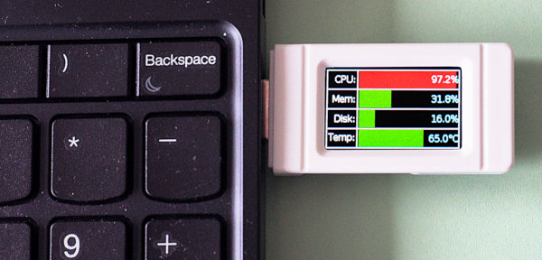
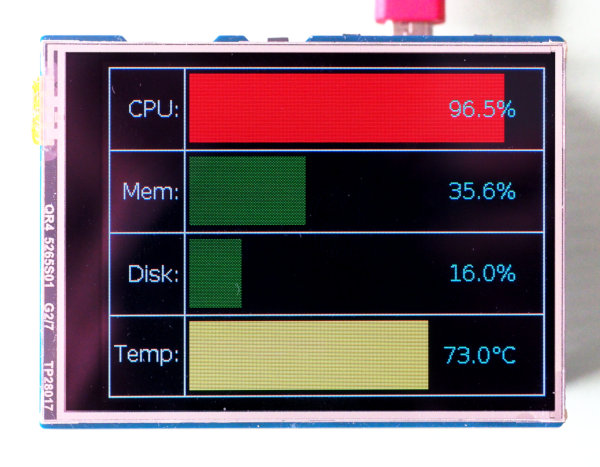

Small System Performance-Monitor
================================

This project implements a plugable performance monitor for PCs.
The datacollector is a small Python script running on the PC collecting
data and sending them using UART over USB. The monitor itself is a
microcontroller (e.g. Raspberry Pi Pico) with an attached display. The
MCU reads the data from the serial connection and does all the
presentation work.




PC-Installation
---------------

The PC-script needs the Python package `psutil` to collect performance
data like free memory, disk space or CPU-temperature. Install this
package either using your package-manager or with pip.

If you are running Linux, use:

    git clone https://github.com/bablokb/cp-sysmon
    cd cp-sysmon
    sudo pc/tools/install

to install the script, an udev-rule and a systemd-service. The latter
two are not strictly necessary, but they automatically start the
PC-script whenever a suitable MCU is plugged in. The script is copied
to `/usr/local/bin/cp_sysmon.py`, the udev-rule to
`/etc/udev/rules.d/99-cp_sysmon.rules` and the systemd-service to
`/etc/systemd/system/cp_sysmon@.service`.


PC-Configuration
----------------

The configuration file for cp-sysmon is `/etc/cp_sysmon.json`. The install
routine above creates a default version:

```
{
  "#": [
     "Unknown keys are ignored and treated as comments",
     "This json-file reproduces the defaults.",
     "All keys below are mandatory if this file exists."
       ],
  "DEBUG": false,
  "BAUD": 115200,
  "INTERVAL": 1.5,
  "SENSORS":  ["cpu", "temp", "mem", "disks"],
  "TEMP": ["thinkpad", "CPU"],
  "DISK_MOUNTS": ["/"],
  "UI_CONFIG": {
    "labels" : ["CPU:",     "Temp:", "Mem:",     "Disk:"],
    "formats": ["{0:.1f}%", "{0}°C", "{0:.1f}%", "{0:.1f}%"],
    "ranges" : [[0,100],    [35,85], [0,100],    [0,100]],
    "colors" : [
      [["0x008000",70],["0xFFFF00",85],["0xFF0000",null]],
      [["0x008000",65],["0xFFFF00",80],["0xFF0000",null]],
      [["0x008000",70],["0xFFFF00",85],["0xFF0000",null]],
      [["0x008000",70],["0xFFFF00",85],["0xFF0000",null]]
    ]
  }
}

```

Although psutil hides most of the specifics of performance data, there is
one important exception: CPU-temperature. A PC has many sensors and the
exact label of the CPU-temperature varies. To find out the correct label,
run

    python3
    >>> import psutil
    >>> psutil.sensors_temperature()

The output is not very readable but you should identify various components
of your PC, e.g. NVMe disks, PCIe bridges or the system itself. Check
which component and label is most suitable and update `TEMP` within
`/etc/cp_sysmon.json`. The value must be an array with the format
`[component, label]`.

The second thing to update are the disk-mount(s), unless you are happy with
the default value. If you have more than a single disk-mount to monitor,
you must also update the `UI_CONFIG` accordingly, i.e. add additional
items to the given lists.

The `INTERVAL` value defines the data-sampling interval.  Sampling
data faster than the MCU is able to process them will result in a
delayed view of the measurements. You can comment out a line at the
bottom of `mcu/main.py` to print the update speed of the MCU. A Pico
(RP2040) with attached ST7789 display can do an update about every 0.8
seconds (this also depends on screen-size and how many values have to
be displayed).

Since there is a delay at startup while the MCU initializes the
display, you should use a value that is higher, or else the MCU will
never catch up. For example with `INTERVAL=1` it takes about 25s until
the MCU shows live data.

You should also keep in mind that short intervals also keep the PC
busy. So sampling as fast as the MCU can process the data is also not
the best idea, especially in high load situations.

The `UI_CONFIG` value is a dict that the system sends to the MCU. `labels`
and `formats` should be self explanatory. `ranges` define the expected
ranges for values and are used for scaling the visual representation.
`colors` are lists that map values to colors: e.g. (first line):
a cpu-value of up to 70% is mapped to "0x008000" (green), values between
70% and 85% are mapped to "0xFFFF00" (yellow) and values above are
mapped to red ("0xFF0000").

Note that if you add more statistics (besides more disk-mounts) you also
have to adapt the collector script (see section "Hacking" below).


Configuring Automatic Start
---------------------------

Besides the data collecter script, you should also update the udev-rule
installed by the install-script. This rule automatically starts the
collector script, but only if the correct device is plugged in. The
rule selects the device by serial-number. To query the serial number of
your device, run

    sudo udevadm monitor -s tty --environment

then plugin your device and scan the output for "ID_SERIAL_SHORT". Replace
the serial-id in `/etc/udev/rules.d/99-cpsysmon.rules`:

    KERNEL=="ttyACM*", SUBSYSTEM=="tty", ACTION=="add", ENV{ID_SERIAL_SHORT}=="DE62A87557822C2A",ENV{ID_USB_INTERFACE_NUM}=="02", RUN+="/bin/systemctl --no-block start cp_sysmon@$kernel.service"

Note that a manual execution of the collector script is always possible.
It starts and waits until the serial device passed as an argument shows up.


MCU-Installation
----------------

For the MCU, you need a device with native USB, e.g. a Pico or an ESP32-S3.
Install the current CircuitPython firmware from <https://circuitpython.org>.

Then copy all all files below `mcu` to your device. Additionally, you should
install the following libraries:

    - adafruit_display_text
    - adafruit_display_shapes
    - adafruit_bitmap_font
    - adafruit_ticks
    - a suitable display driver, e.g. adafruit_st7789

The tool `circup` (installable via pip) is the recommended way of installing
these libraries, e.g.:

    sudo apt-get -y install pip3
    pip3 install circup
    circup --path /path/to/device install -r requirements.txt


MCU-Configuration
-----------------

You need to configure some basic settings and the display driver for
the display that is attached to the MCU. `main.py` reads the
configuration from `config.py`. Copy one of the existing examples
`mcu/config_*` to `mcu/config.py` and adapt the settings and the
driver for your needs.

The file `mcu/config_st7789_240x135.py` is for the Waveshare
RP2040-Geek (with integrated Pico and ST7789 display), see the image
above. The file `mcu/config_waveshare_res_touch_28.py` is for the
Waveshare Res-Touch-LCD-2.8". This display has sockets for a Pico
underneath.



As this display is quiete large, it would be suitable to display more
data.


Hacking
-------

The current implementation only collects a few core performance data. You
can change the collector and mcu script to collect and display more
endpoints.

In the collector script (`/usr/local/bin/cp_sysmon.py`), just add more
items to the data-object:

    data = [f"{psutil.cpu_percent()}",
            f"{get_temp()}",
            f"{psutil.virtual_memory().percent}"]
    for mnt in cfg.DISK_MOUNTS:
      data.append(f"{psutil.disk_usage(mnt).percent}")

Adding more endpoints also needs an adaption of `UI_CONFIG` in
`/etc/cp_sysmon.json` as described above.

Another option would be to add data-logging. Many displays already have
an integrated SD-card slot, so besides live display of performance data
the system could also log them to a SD-card. This is not implemented yet,
pull requests are welcome. For performance reasons data-logging is best
done directly on the host though.
